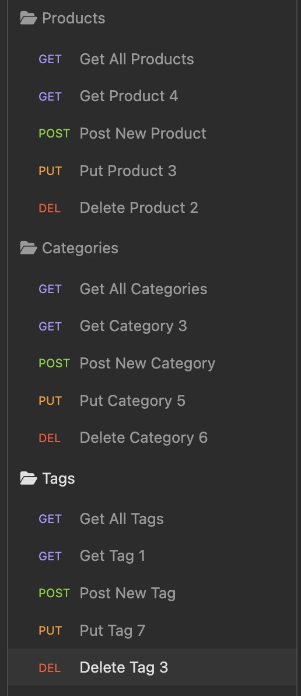

# E-Commerce Back End 

## Technology Used 

| Technology Used         | Resource URL           | 
| ------------- |:-------------:| 
| JavaScript    | [https://developer.mozilla.org/en-US/docs/Web/JavaScript](https://developer.mozilla.org/en-US/docs/Web/JavaScript) | 
| Node.js     | [https://nodejs.org/en/](https://nodejs.org/en/)      |   
| MySQL | [https://www.mysql.com/](https://www.mysql.com/)     |   
| MySQL2 |  [https://www.npmjs.com/package/mysql2](https://www.npmjs.com/package/mysql2) |
| dotenv | [https://www.npmjs.com/package/dotenv](https://www.npmjs.com/package/dotenv) |
| Sequelize | [https://sequelize.org/](https://sequelize.org/) |
| Insomnia | [https://insomnia.rest/](https://insomnia.rest/) |

 

## Description 

[Walk-Through Video](https://drive.google.com/file/d/1tPg9yEvpax0fkpjHqdYd21qmQRoUrng7/view?usp=sharing)

This project represents the back end of an e-commerce site. It includes a MySQL database with tables for products, categories, and tags. The application uses MySQL2 and Sequelize to manage and interact with the database. In addition, the dotenv npm package is used to interact with a .env file to store database credentials. Because this project strictly includes a back end, Insomnia is used to test the RESTful API routes. The application is capable of creating, reading, updating, and deleting records in every table within the database. Starter code for this project included the server.js file, the database schema, and the seeds. I built the models and most of the routes, and I integrated dotenv. The image below shows the test routes created in Insomnia.

 

## Usage 

This application does not have a front end, and the server is not deployed, so usage is not possible. To simulate usage, I created and seeded the database on my local machine, then used Insomnia to test the routes. The image below shows an example of the results of one such test (retrieving all products from the database).

 

## Learning Points 

* Object Relational Mapping (ORM)
* Sequelize

## Author Info

### Ryan Moscoe 

* [Portfolio](https://rmoscoe.github.io/portfolio/)
* [LinkedIn](https://www.linkedin.com/in/ryan-moscoe-8652973/)
* [Github](https://github.com/rmoscoe)

 

## Credits

Starter code provided by Trilogy Education Services, LLC, a 2U, Inc. brand, in conjunction with the University of California, Berkeley.

 

## License

See repository for license iformation.